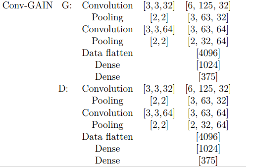

<h1>Convolutional generative adversarial imputation networks for spatio-temporal missing data (Conv-GAIN)</h1>
The objective of this project is to Implement the the <a href="https://arxiv.org/abs/2111.02823">Conv-GAIN paper.</a>   
<li>Authors: Ehsan Adeli, Jize Zhang, Alexandros A. Taflanidis</li> 
<li>Paper: Ehsan Adeli, Jize Zhang, Alexandros A. Taflanidis, "Conv-GAIN: Missing Data Imputation using Convolutional Generative Adversarial Nets for spatio-temporal missing data in storm surge simulations. 26 Nov 2021.</li> 
<li>Paper Link: (<a href="https://arxiv.org/abs/2111.02823">Paper</a>)</li> 
<li>Contact: Sedeeq.alaa@gmail.com</li> 

<li> This implementation is used in my collaboration project <a href="https://github.com/AlaaSedeeq/Millan-Data-Imputation-And-Forecasting">Millan Data Imputation And Forecasting</a>

<h4>My HandWritten Conv-GAIN architecture</h4>
</img>

<h4>The Proposed Conv-GAIN model in the paper</h4>
</img>
